# Architecture section:

### High-level architecture diagram or description:

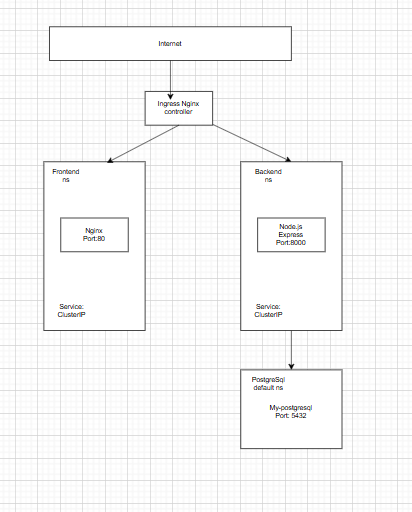
### name space organization:

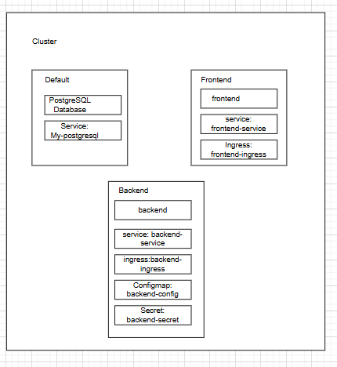

### user flow:

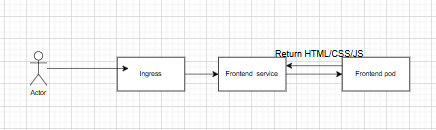

### network flow:

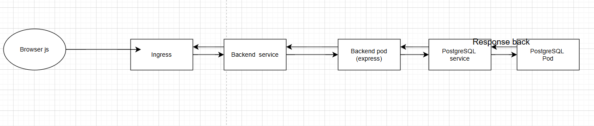

## API Endpoints Section

Complete list of all API endpoints:

| Endpoint | Method | Purpose | Request Body |
| --- | --- | --- | --- |
| /api/employee | GET | Get all employee | None |
| /api/employee/:id | GET | Get one employee | None |
| /api/employee | POST | Create one employee | need data to create  |
| /api/employee/:id | PATCH | Update employee | need data to update |
| /api/employee/:id | DELETE | Delete employee | none |
| /api/health | GET | Health check | none |

## api example:

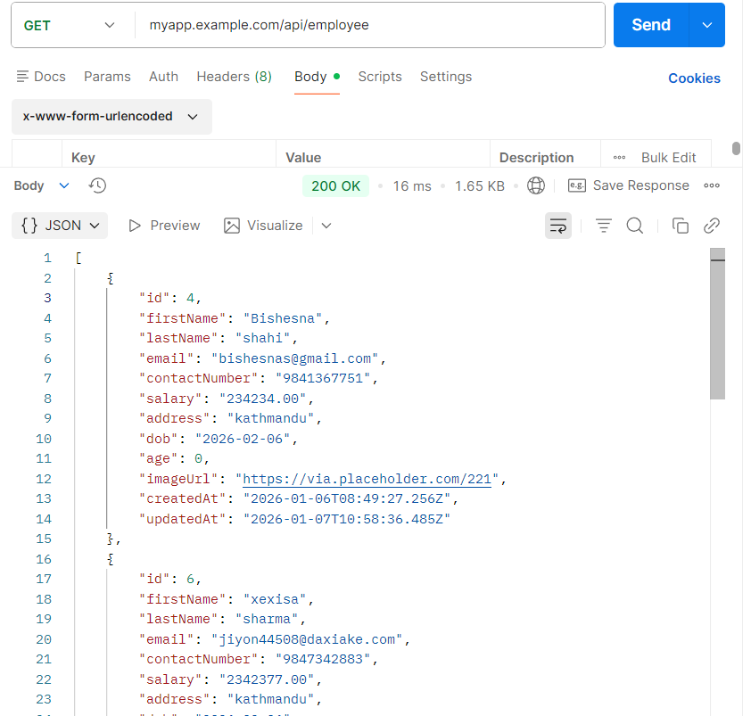

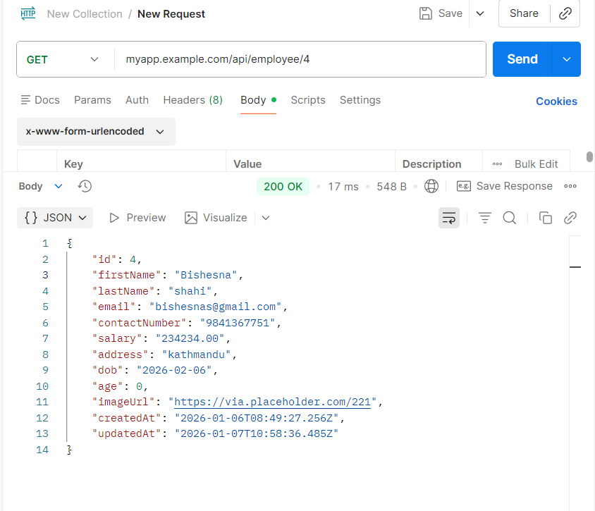

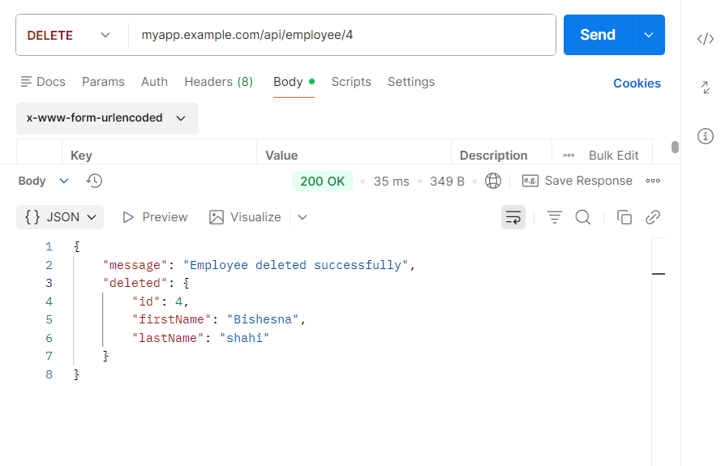

---

## Deployment Instructions:

**prerequisite:**

- Docker desktop: enable Kubernetes
- helm

How Directory is maintained:

```powershell
assignment
|_____backend
|        |______packages
|        |______script.js
|        |______DockerFile
|_____Frontend
        |______DockerFile
        |______index.html
        |_______style.css
        |_______index.js

|_____Kubnernetes
         |_______configmap.yaml
         |_______deployment-b.yaml
         |_______deployemnt.yaml
         |_______service_backend.yaml
         |_______service_frontend.yaml
         |_______secret-b.yaml
         |_______ingress-b.yaml
         |_______ingress.yaml
         |_______values.yaml
         |_______Readme.md
         
```

### Image creation

To create a docker file for frontend you must be inside the Frontend folder where Dockerfile for frontend. here i build image of some-content-nginx

docker build -t <nameofimage> .

```powershell
docker build -t some-content-nginx .
```

To create a docker file for backend you must be inside the Backend folder where Dockerfile for Backend. here I build image of node-backend.

```powershell
docker build -t node-backend .
```

---

### now lets deploy first Database:

I used helm values for postgres: 

```powershell
helm repo add bitnami https://charts.bitnami.com/bitnami
```

```powershell
helm install my-postgresql bitnami/postgresql --version 18.2.0 --values values.yaml 
```

```powershell
helm upgrade --install my-postgresql bitnami/postgresql --version 18.2.0 --values values.yaml
```

now to create Database, user and tables:

go to the running pod of postgres:

```powershell
kubectl exec -it podname -n database - - bash
```

```powershell
psql --host my-postgresql -U postgres -d postgres -p 5432
```

for password:

```powershell
 kubectl get secret my-postgresql -n database
-o jsonpath="{.data.postgres-password}" | base64 --decode
```

Inside the Database:

```powershell
 psql --host my-postgresql -U myapp_user -d myapp_db -p 5432
```

`CREATE DATABASE myapp_db;
CREATE USER myapp_user WITH PASSWORD 'mynewpassword';
GRANT ALL PRIVILEGES ON DATABASE myapp_db TO myapp_user;`

to create employees table

```sql
CREATE TABLE employees (
    id SERIAL PRIMARY KEY,
    first_name VARCHAR(100) NOT NULL,
    last_name VARCHAR(100) NOT NULL,
    email VARCHAR(255) UNIQUE NOT NULL,
    contact_number VARCHAR(20) NOT NULL,
    salary NUMERIC(10, 2) NOT NULL,
    address TEXT NOT NULL,
    dob DATE NOT NULL,
    age INTEGER,
    image_url TEXT,
    created_at TIMESTAMP DEFAULT CURRENT_TIMESTAMP,
    updated_at TIMESTAMP DEFAULT CURRENT_TIMESTAMP
);
```

```sql
GRANT ALL PRIVILEGES ON TABLE employees TO myapp_user;
GRANT USAGE, SELECT ON SEQUENCE employees_id_seq TO myapp_user;
```

check if they are applied:

```sql
kubectl get pods 
```

```sql
kubectl get secrets
```

```sql
kubectl get pv
```

```sql
kubectl get pvc 
```

To connect with pgadmin 4 

```sql
kubectl port-forward svc/<svc_name> 5432:5432
```

---

apply ingress:

```sql
kubectl apply -f https://raw.githubusercontent.com/kubernetes/ingress-nginx/controller-v1.10.1/deploy/static/provider/cloud/deploy.yaml
```

```sql
kubectl get ns
```

see if there is ns ingress-nginx

```sql
kubect get pods -n ingress-nginx
```

Now lets deploy backend:

```sql
kubectl create ns backend
```

```sql
kubectl apply deployment-b.yaml -n backend
```

```sql
kubectl apply service_backend.yaml -n backend
```

```sql
kubectl apply ingress-b.yaml -n backend
```

```sql
kubectl apply secret-b.yaml -n backend
```

```sql
kubectl apply configmap.yaml -n backend
```

to see if it is all applied:

```sql
kubectl get pods -n backend
```

```sql
kubectl get svc -n backend
```

```sql
kubectl get secrets -n backend
```

```sql
kubectl get configmap -n backend
```

```sql
kubectl get ingress -n backend
```

check if pods are creates 

---

now lets deploy frontend:

```sql
kubectl create ns frontend
```

```sql
kubectl apply service_frontend.yaml -n frontend
```

```sql
kubectl apply deployment.yaml -n frontend
```

```sql
kubectl apply ingress.yaml -n frontend
```

check is it is applied:

```sql
kubectl get ingress -n frontend
```

```sql
kubectl get pods -n frontend
```

```sql
kubectl get svc -n frontend
```

---

## replica analysis:

`kubectl scale deployment backend --replicas=2 -n backend`

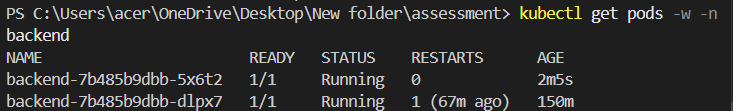

**In 2 replica scenario:**

- first task is sent to first pod
- and send task is sent to second pod

In this scenario, I added a new employee so one pod is responsible to add a new employ to database but we also need to fetch instantly. so another pod has less load, the request is sent to it.

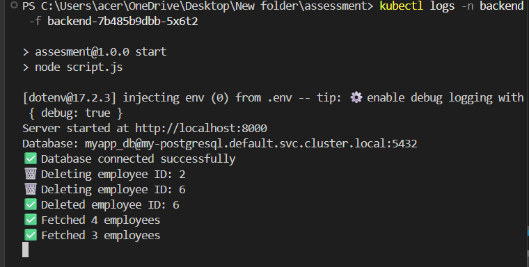

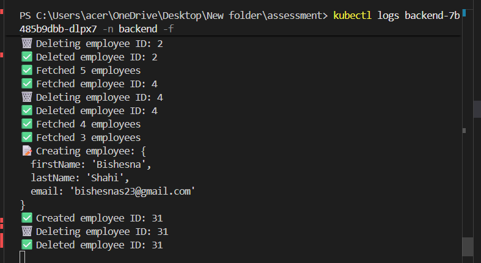

**In scenario of 4:**

I sent a first request of creating a user. pod 1 handled the request, it created an employee. After the user is created, it needs to be fetched so the pod 2 handles it. Now when i sent a request to edit the pod, pod 3 handles the request as it has less request and then to fetch the data pod 4 takes the request. 

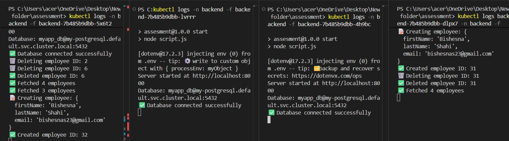

---

## liveness:

test1(wrong path):

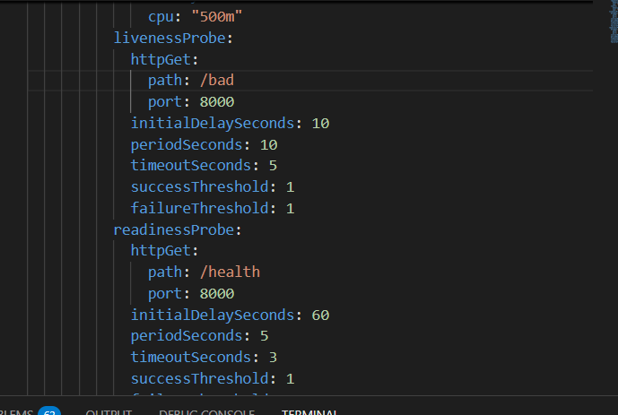

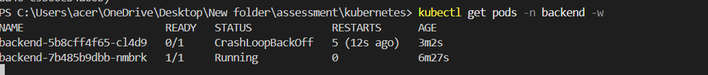

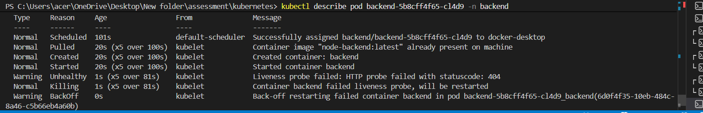

test2 faliure thershold change


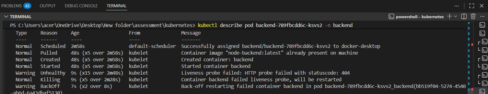

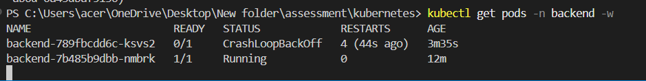

test3   timeoutSeconds:

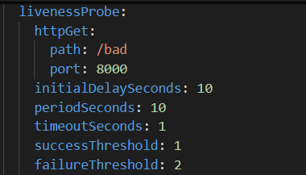

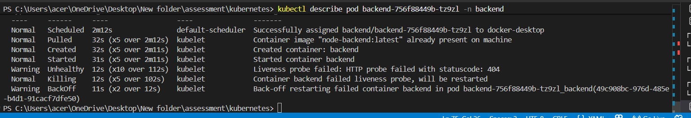

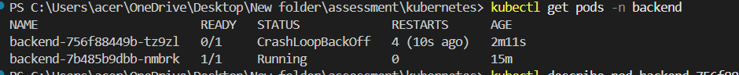

---

## readiness

test

I scaled database to 0 to temporarily give 503 error which means Service Unavailable. Now our backend did not get the essential service which gave readiness error 503(unhealthy).

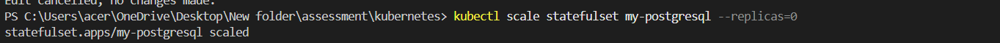

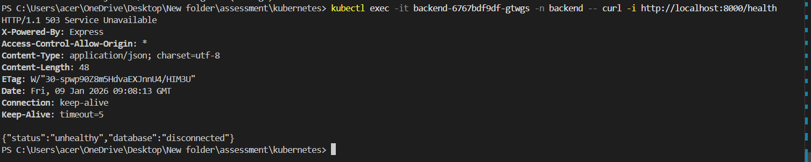

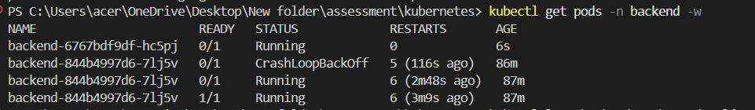

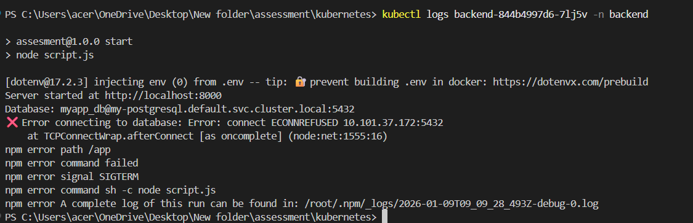

It also removed the endpoint as readiness failure lead to removing from the service.

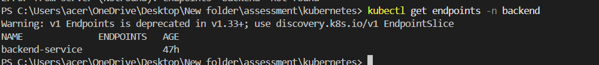

i scaled database pod back to 1 which made pod running and replica error remove.

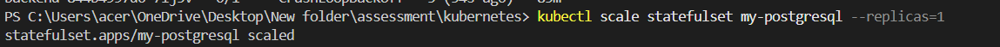


We got the endpoints back.

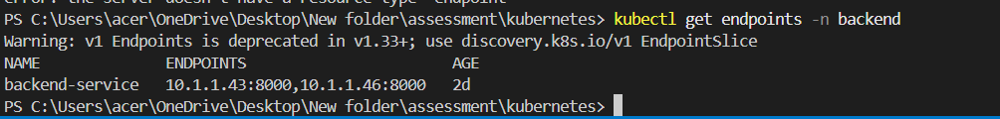

next i gave wrong path :


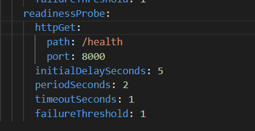

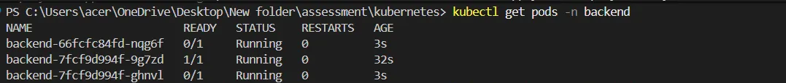

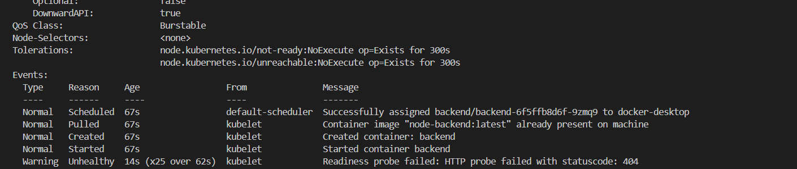

then i changed it to back to the correct path and did rollout restarted now it is back to the ready to serve.

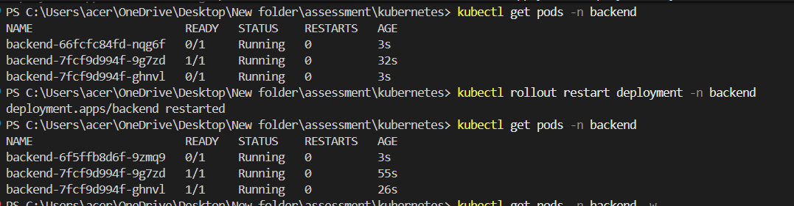

## Frontend:

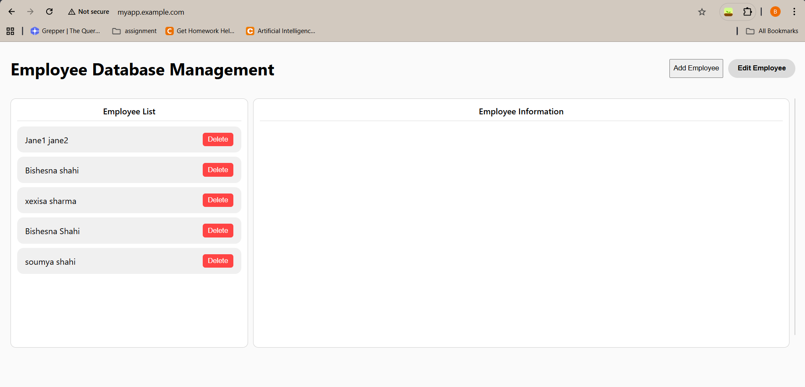

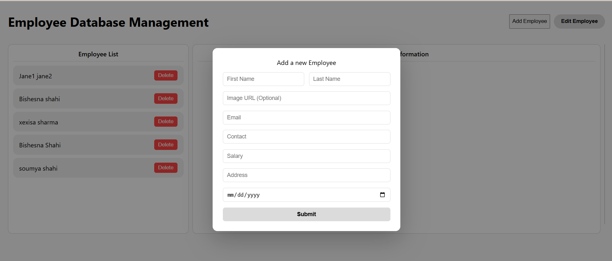


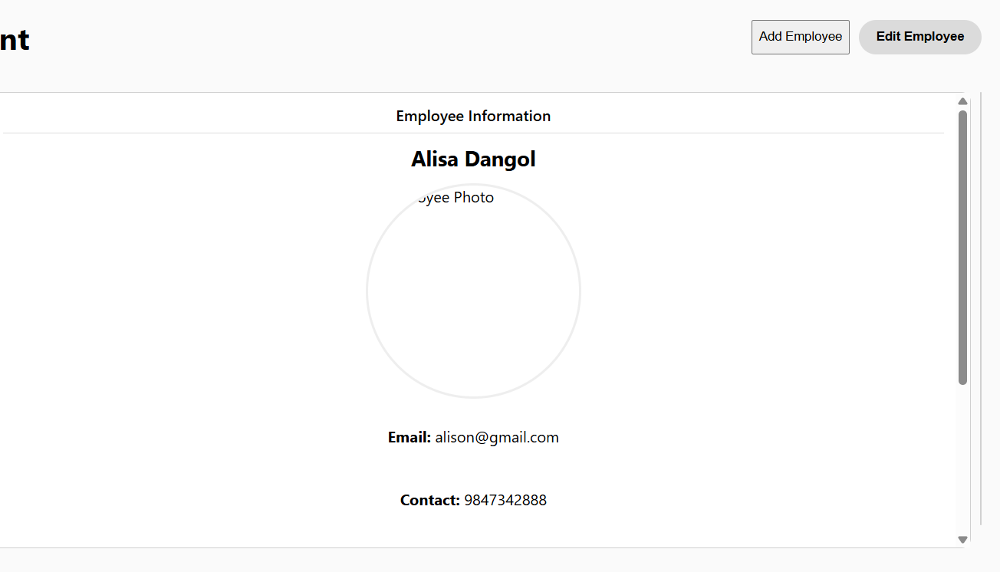

# curd operation:

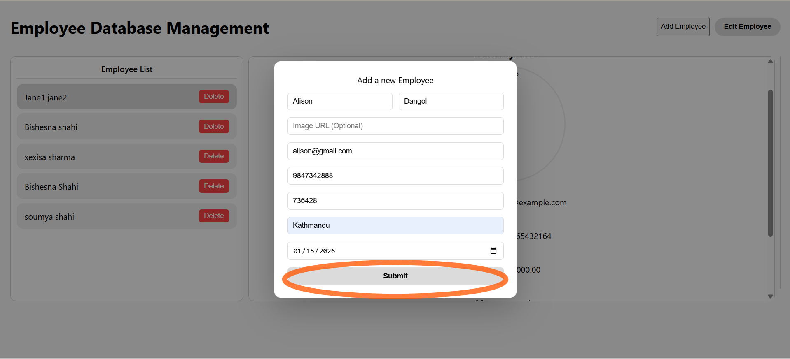

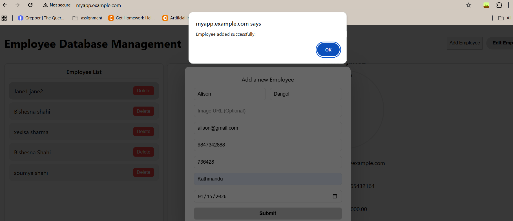

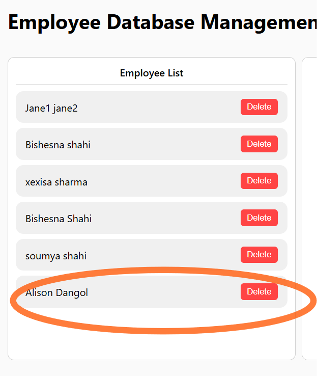

## to edit:

**first click to your select user**

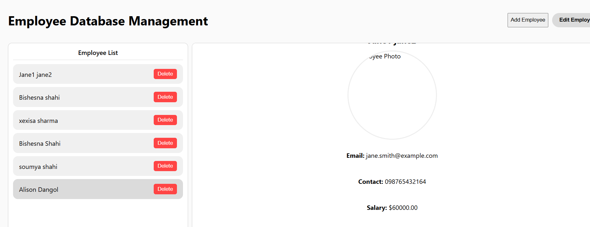

**make a required change** 


**we can see the changed data** 

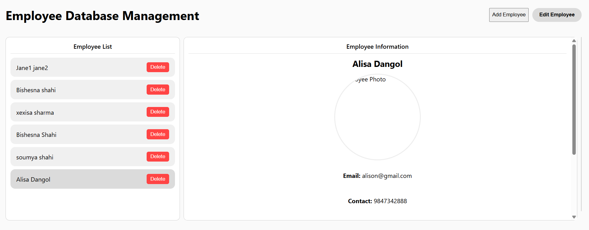

## **Delete:**

**click the delete button**


# Database:


# references:

https://www.geeksforgeeks.org/javascript/employee-database-management-system-using-html-css-and-javascript/

https://semaphore.io/blog/kubernetes-probes

https://medium.com/@jrkessl/readiness-vs-liveness-probes-what-is-the-difference-and-startup-probes-215560f043e4

https://www.groundcover.com/blog/kubectl-scale

https://last9.io/blog/how-replicas-work-in-kubernetes/

https://palark.com/blog/best-practices-for-deploying-highly-available-apps-in-kubernetes-part-1/

https://medium.com/@jadhav.swatissj99/ingress-routing-in-kubernetes-a-detailed-explanation-5aab2f225613